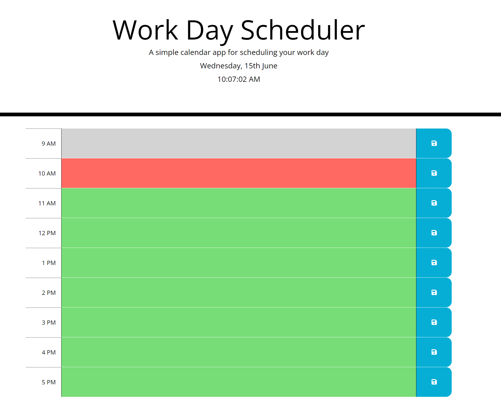

# Module 5 - Work Day Scheduler
## Description
Create a daily planner used for recording tasks and events between standard operating business hours.

## Table of Contents
1. [Visuals](#visuals) 
2. [Usage](#usage)
3. [Link to site](#link-to-site)

## Visuals

## Usage
This faily planner is mainly meant to be utilised for sample purposes only. This is a test for utilising various API's and JS libraries to create a daily planner where the user can store a task in each timeslot for standard operational business hours. 

Utilised: JQuery, Bootstrap, Moment, Font Awesome.

## Link to site
https://flipper5001.github.io/work-day-scheduler/

